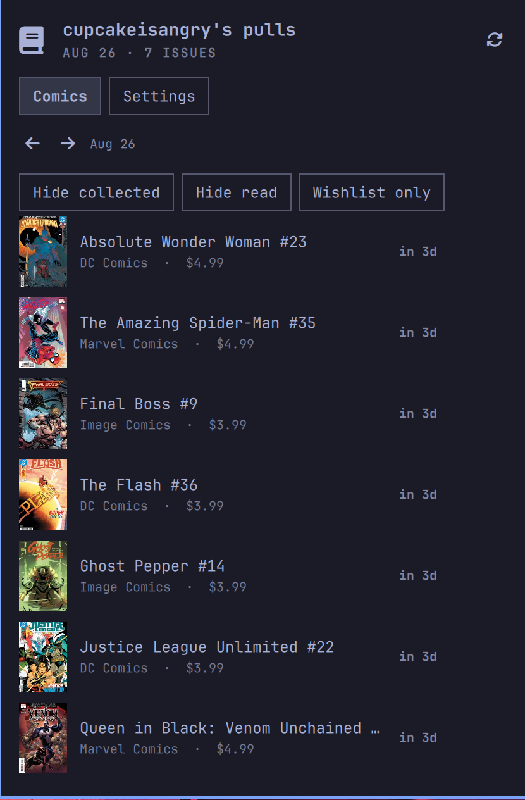
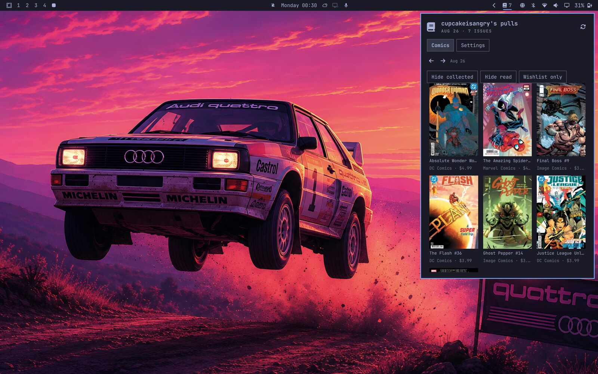

# Longbox

A comic pull-list widget for the Omarchy bar.

<p>
  
  
  
</p>

Longbox shows your pull list from [leagueofcomicgeeks.com](https://leagueofcomicgeeks.com) as a bar count, with a popup panel listing this week's comics: cover art, publisher, price, and release status. Browse the weekly release sheet for any week, mark issues as collected/read/wishlisted, and optionally sign in to load your pulls live for every week - past and future.

## Install

```sh
omarchy plugin add https://github.com/angry-cupcake/longbox.git --enable
```

## Usage

- **Left-click** the book icon to open the panel
- **Right-click** to open your pull list (or the release sheet) on leagueofcomicgeeks.com
- Hover a comic to preview it; click to open its LoCG page
- Hover actions mark comics as collected, read, or wishlisted
- The arrow buttons move between weeks; the clock button jumps back to the current week

### Getting started (no account needed)

On first open you land on Settings. Two ways to use Longbox anonymously:

- **Profile name**: enter your LoCG username and Save. Your public pull list loads for the current week. Past weeks come from the local archive (see Storage below).
- **Releases mode**: leave the profile blank and switch Source to "Releases" to browse everything shipping that week.

### Optional sign-in

The League of Comic Geeks section can sign you in. Anonymous access always works for basics; signing in adds:

- **Live history**: your pull list loads from LoCG's API for any past or future week - no waiting for the local archive to accumulate.
- **Resilience**: if a live fetch fails while browsing history, an archived snapshot is shown automatically when one exists.

Security model: your password is used once for the sign-in request and never written anywhere - not even to disk or to the process list, since it and your session cookies are passed to curl through a configuration file fed over standard input, never through command-line arguments visible in `/proc/<pid>/cmdline` or through environment variables. Only the resulting session cookie is stored, in a state file kept owner-only (`chmod 600`). LoCG expires sessions after a while; when that happens Longbox quietly falls back to anonymous mode and asks you to sign in again.

### Marks

Hover actions set local marks: **collected**, **read**, or **wishlist**. Marks are stored on this device only and survive even with data caching disabled. They do not sync to your LoCG account yet (see Roadmap).

## Settings tab

Options are grouped into collapsible sections ordered by how often they change:

| Section | Default state | Contents |
|---------|---------------|----------|
| Comics | open | Source (pulls/releases), view mode, variant covers, cover art, refresh interval |
| League of Comic Geeks | opens when relevant | Profile name, optional sign-in/sign-out |
| Storage | collapsed | Local caching, pull-list archiving, clear buttons |
| Advanced | collapsed | Cloudflare clearance escape hatch |

Storage notes: "Store comic data locally" keeps a small cache so the panel opens instantly and works offline; turning it off clears cached data immediately and disables offline reads. "Archive past pull lists" snapshots each week's pulls while current, building browsable history over time (26 weeks kept). Archiving stays useful even when signed in as an offline fallback.

Marks, profile, session cookie, and preferences persist in `~/.local/state/omarchy/settings/longbox.json`.

## Configure via shell.json

Settings seed from `~/.config/omarchy/shell.json` under the widget entry on first run only; changes made in the panel's Settings tab take precedence afterward.

| Key | Default | Description |
|-----|---------|-------------|
| `username` | *(empty)* | Your LoCG username; leave blank for general weekly releases |
| `source` | `pulls` | `pulls` or `releases` (everything shipping that week) |
| `excludeVariants` | `true` | Hide variant covers (releases source only) |
| `showCovers` | `true` | Cover thumbnails in comic lists |
| `refreshIntervalMin` | `360` | Fetch interval in minutes (1h-12h); be gentle, LoCG rate-limits |

## Dependencies

- [curl](https://curl.se/) (preinstalled on Omarchy) - all network access happens through short-lived curl processes over HTTPS. No other external commands are executed.
- Node.js for the test suite only.

## How it fetches

Anonymous pulls scrape the public profile page; releases use the same AJAX endpoint the LoCG website itself calls. Signed-in pull lists go through that endpoint with your session cookie for any dated week. All of these are undocumented surfaces and can change; if they do, Longbox tells you rather than showing a silently empty list.

## Known limitations

- Anonymous pull lists are only public for the current week. Past weeks need archiving (opt-in), or sign-in for live browsing.
- Marks are local to this device and do not sync to LoCG yet.
- Sessions expire on LoCG's side after some weeks; sign-in is manual by design since passwords are never stored.
- Aggressive refreshing gets bot-checked by Cloudflare. The default 6-hour interval stays well under that; if it still bites, use the Advanced clearance escape hatch.

## Roadmap

Planned next, roughly in order:

1. **Mark syncing** - push collected/read/wishlist taps to LoCG via the authenticated list endpoint when signed in, with local marks remaining the offline fallback.
2. **Collection import** - read your existing LoCG collection state so glyphs reflect reality instead of starting empty.
3. **Pull subscriptions from the widget** - subscribe to a series straight from the release sheet using the signed-in session.

## Development

Run the test suite (no dependencies beyond Node):

```sh
node --test "tests/*.test.js"
```

Fixtures under `tests/fixtures/` were captured from real LoCG pages and API responses and keep the parser honest. Highlights: `ajax-pulls-auth.json` is a real signed-in dated pull response; `ajax-anon-pulls.json` shows the anonymous/expired signature; `profile-pull-list.html` carries the numeric user id the sign-in flow needs.

## Remove

```sh
omarchy plugin remove angry-cupcake.longbox
```
